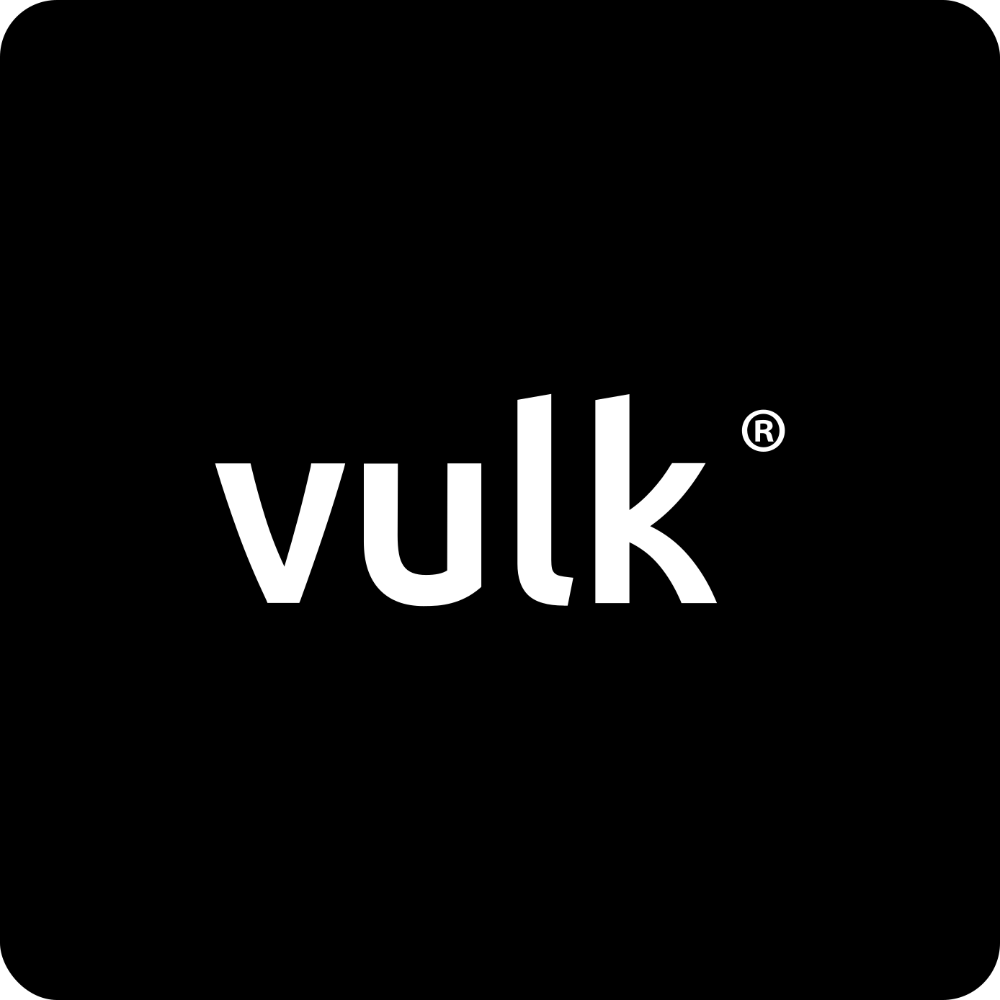

# VULK® - Full-Stack Development Platform

  
  
  <h3>Full-Stack Applications Development</h3>
  
Create complete applications with automatic API integration and instant deployment

  
  

    <a href="#features">Features</a> •
    <a href="#getting-started">Getting Started</a> •
    <a href="#documentation">Documentation</a> •
    <a href="#contributing">Contributing</a> •
    <a href="#license">License</a>
  

  
  

    <a href="https://vulk.dev">Website</a> •
    <a href="https://vulk.dev/beta">Beta Access</a> •
    <a href="https://github.com/vulk-ai/vulk">GitHub</a>
  

---

## What is VULK®?

VULK® is a full-stack development platform that automatically generates complete applications with integrated APIs and instant deployment capabilities.

### Key Features

- **Full-Stack Generation**: Complete applications with frontend, backend, and database
- **Automatic API Integration**: Seamless integration with external services and APIs
- **Instant Deployment**: Deploy with custom domains or subdomains in seconds
- **Multi-Provider Support**: Works with Vercel, Netlify, Cloudflare, and other services

## Core Features

### Full-Stack Development
- **Complete Applications**: Generate frontend, backend, and database in one go
- **Framework Support**: React, Vue, Svelte, Flutter with modern UI libraries
- **Database Integration**: PostgreSQL, MySQL, MongoDB with automatic setup
- **API Integration**: Automatic integration with external services and APIs

### Automatic API Integration
- **Service Detection**: Automatically detects required APIs and services
- **Key Management**: Handles API keys and authentication automatically
- **Service Configuration**: Pre-configured integrations with popular services
- **Real-time Updates**: Live integration status and error handling

### Instant Deployment
- **One-Click Deploy**: Deploy to multiple platforms with a single click
- **Custom Domains**: Use your own domain or get instant subdomains
- **SSL Certificates**: Automatic HTTPS setup and certificate management
- **Environment Management**: Separate staging and production environments

### Quality Assurance
- **Automated Testing**: Built-in testing and validation
- **Code Quality**: Automatic linting and code formatting
- **Security Scanning**: Built-in security checks and vulnerability detection
- **Performance Optimization**: Automatic performance monitoring and optimization

---

## Getting Started

Register at [vulk.dev/register](https://vulk.dev/register) to get access to:
- Full-stack application generation
- Automatic API integration
- Instant deployment capabilities
- Advanced development features

## Documentation

- **[User Guide](docs/user-guide.md)** - Complete user documentation
- **[API Reference](docs/api-reference.md)** - Developer API documentation
- **[Deployment Guide](docs/deployment.md)** - Deployment best practices

## Use Cases

### Enterprise Development
- **Rapid Prototyping**: Create MVPs in hours, not weeks
- **Team Collaboration**: Real-time development and collaboration
- **Quality Assurance**: Automated testing and code review
- **Scalable Architecture**: Enterprise-grade deployment options

### Startup & MVP Development
- **Fast Iteration**: Rapidly prototype and test ideas
- **Cost Effective**: Reduce development time and costs
- **Professional Quality**: Enterprise-grade code generation
- **Easy Deployment**: One-click deployment to production

## Why VULK?

### Key Benefits
- **Complete Applications**: Generate full-stack applications with all components
- **Automatic Integration**: Seamless API and service integration
- **Instant Deployment**: Deploy with custom domains in seconds
- **Professional Quality**: Enterprise-grade code and architecture

## Contributing

We welcome contributions! Please see our [Contributing Guide](CONTRIBUTING.md) for details.

## License

This project is licensed under the MIT License - see the [LICENSE](LICENSE) file for details.

## Links

- **Website**: [vulk.dev](https://vulk.dev)
- **Register**: [vulk.dev/register](https://vulk.dev/register)
- **Documentation**: [docs.vulk.dev](https://docs.vulk.dev)
- **Community**: [Discord](https://discord.gg/vulk)
- **Twitter**: [@VULK_AI](https://twitter.com/VULK_AI)

---

  
<strong>VULK® — Full-stack development platform with automatic API integration and instant deployment.</strong>

  
Made by <a href="https://www.code-ahead.com">CodeAhead</a>

  
<strong>Leadership:</strong> CEO & CTO, Joana Matos (CEO)

