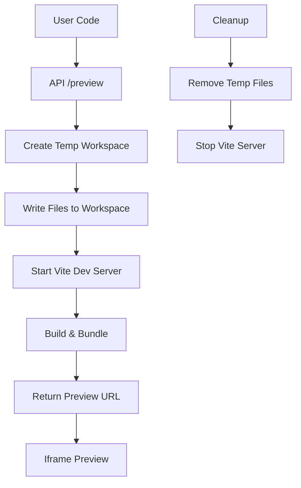

# 🚀 VULK Preview System - Vite Implementation Proposal

## 🎯 Objetivo
Substituir o sistema atual de Babel standalone por Vite para maior segurança, performance e compatibilidade.

## 🔥 Problemas Atuais

### ❌ Babel Standalone (Atual)
- **Segurança**: Executa código não confiável no browser
- **Performance**: Transpilação lenta em tempo real
- **Compatibilidade**: Muitos erros de sintaxe TypeScript/React
- **Manutenção**: Regex complexos para "limpar" código
- **Limitações**: Não suporta todas as features modernas

### ✅ Vite (Proposta)
- **Segurança**: Build server-side, sandboxed
- **Performance**: Build otimizado com cache
- **Compatibilidade**: Suporte nativo TypeScript + React
- **Hot Reload**: Desenvolvimento mais rápido
- **Produção**: Build otimizado

## 🏗️ Arquitetura Proposta

### 1. Estrutura de Diretórios
```
vulk-main/
├── src/
│   ├── app/
│   │   └── api/
│   │       └── preview/
│   │           └── route.ts          # API endpoint
│   └── lib/
│       ├── vite-preview/
│       │   ├── vite-server.ts       # Vite dev server
│       │   ├── preview-builder.ts   # Build system
│       │   └── sandbox.ts           # Security sandbox
│       └── preview-templates/
│           ├── react-template/      # Template React
│           ├── vue-template/        # Template Vue
│           └── vanilla-template/    # Template Vanilla
└── preview-workspace/               # Workspace temporário
    ├── vite.config.ts
    ├── package.json
    └── src/
        └── main.tsx
```

### 2. Fluxo de Trabalho



## 🔧 Implementação

### 1. API Endpoint (`/api/preview/route.ts`)
```typescript
import { VitePreviewBuilder } from '@/lib/vite-preview/preview-builder';

export async function POST(request: NextRequest) {
  try {
    const { code, framework = 'react' } = await request.json();
    
    const builder = new VitePreviewBuilder();
    const previewUrl = await builder.createPreview(code, framework);
    
    return NextResponse.json({ 
      previewUrl,
      type: 'vite-preview' 
    });
  } catch (error) {
    return NextResponse.json({ error: error.message }, { status: 500 });
  }
}
```

### 2. Vite Preview Builder (`/lib/vite-preview/preview-builder.ts`)
```typescript
import { spawn } from 'child_process';
import { writeFileSync, mkdirSync } from 'fs';
import { join } from 'path';

export class VitePreviewBuilder {
  private workspaceId: string;
  private workspacePath: string;

  constructor() {
    this.workspaceId = `preview-${Date.now()}-${Math.random().toString(36).substr(2, 9)}`;
    this.workspacePath = join(process.cwd(), 'preview-workspace', this.workspaceId);
  }

  async createPreview(code: string, framework: string): Promise<string> {
    // 1. Create temporary workspace
    await this.createWorkspace(framework);
    
    // 2. Write user code to workspace
    await this.writeUserCode(code, framework);
    
    // 3. Start Vite dev server
    const previewUrl = await this.startViteServer();
    
    // 4. Schedule cleanup
    this.scheduleCleanup();
    
    return previewUrl;
  }

  private async createWorkspace(framework: string) {
    mkdirSync(this.workspacePath, { recursive: true });
    
    // Copy template files
    const templatePath = join(process.cwd(), 'src/lib/preview-templates', framework);
    await this.copyTemplate(templatePath, this.workspacePath);
  }

  private async writeUserCode(code: string, framework: string) {
    const mainFile = join(this.workspacePath, 'src', 'main.tsx');
    const template = this.getTemplate(framework);
    const fullCode = template.replace('{{USER_CODE}}', code);
    
    writeFileSync(mainFile, fullCode);
  }

  private async startViteServer(): Promise<string> {
    return new Promise((resolve, reject) => {
      const vite = spawn('npx', ['vite', '--port', '0', '--host'], {
        cwd: this.workspacePath,
        stdio: 'pipe'
      });

      vite.stdout.on('data', (data) => {
        const output = data.toString();
        const urlMatch = output.match(/Local:\s+(https?:\/\/[^\s]+)/);
        if (urlMatch) {
          resolve(urlMatch[1]);
        }
      });

      vite.stderr.on('data', (data) => {
        console.error('Vite error:', data.toString());
      });

      vite.on('error', reject);
    });
  }

  private scheduleCleanup() {
    // Cleanup after 30 minutes
    setTimeout(() => {
      this.cleanup();
    }, 30 * 60 * 1000);
  }

  private async cleanup() {
    // Stop Vite server
    // Remove workspace files
    // Clean up resources
  }
}
```

### 3. Template React (`/lib/preview-templates/react/main.tsx`)
```typescript
import React from 'react';
import ReactDOM from 'react-dom/client';
import './index.css';

// User code will be injected here
{{USER_CODE}}

// Auto-detect and render component
const root = ReactDOM.createRoot(document.getElementById('root')!);

// Try to find the main component
const Component = window.MainComponent || 
                 window.App || 
                 window.Component || 
                 (() => <div>No component found</div>);

root.render(<Component />);
```

### 4. Vite Config (`/lib/preview-templates/react/vite.config.ts`)
```typescript
import { defineConfig } from 'vite';
import react from '@vitejs/plugin-react';
import { resolve } from 'path';

export default defineConfig({
  plugins: [react()],
  build: {
    outDir: 'dist',
    rollupOptions: {
      input: {
        main: resolve(__dirname, 'index.html')
      }
    }
  },
  server: {
    port: 0, // Random port
    host: true,
    cors: true
  },
  define: {
    'process.env.NODE_ENV': '"development"'
  }
});
```

## 🔒 Segurança

### 1. Sandboxing
```typescript
// /lib/vite-preview/sandbox.ts
export class PreviewSandbox {
  private allowedImports = [
    'react', 'react-dom', 'vue', '@vue/runtime-dom',
    'lucide-react', 'framer-motion'
  ];

  private blockedPatterns = [
    /import.*fs.*from/,
    /import.*path.*from/,
    /import.*child_process/,
    /require\(['"]fs['"]\)/,
    /process\.env/,
    /window\.location/,
    /document\.cookie/
  ];

  sanitizeCode(code: string): string {
    let sanitized = code;
    
    // Remove blocked imports
    this.blockedPatterns.forEach(pattern => {
      sanitized = sanitized.replace(pattern, '// Blocked import removed');
    });
    
    // Validate allowed imports only
    const importRegex = /import\s+.*?\s+from\s+['"]([^'"]+)['"]/g;
    sanitized = sanitized.replace(importRegex, (match, importPath) => {
      if (this.allowedImports.includes(importPath)) {
        return match;
      }
      return `// Blocked import: ${importPath}`;
    });
    
    return sanitized;
  }
}
```

### 2. Resource Limits
```typescript
// Limit workspace size, execution time, memory usage
const RESOURCE_LIMITS = {
  maxWorkspaceSize: '100MB',
  maxExecutionTime: 30000, // 30 seconds
  maxMemoryUsage: '512MB',
  maxConcurrentPreviews: 10
};
```

## 🚀 Vantagens da Implementação

### ✅ Segurança
- **Sandboxed**: Código executado em ambiente isolado
- **Server-side**: Build acontece no servidor, não no browser
- **Resource limits**: Controle de recursos (CPU, memória, disco)
- **Import validation**: Apenas imports permitidos

### ✅ Performance
- **Vite HMR**: Hot reload instantâneo
- **Build cache**: Cache inteligente de builds
- **Tree shaking**: Bundle otimizado
- **Code splitting**: Carregamento eficiente

### ✅ Compatibilidade
- **TypeScript nativo**: Sem regex complexos
- **React 18**: Suporte completo
- **Vue 3**: Suporte opcional
- **Modern JS**: ES2022+, decorators, etc.

### ✅ Developer Experience
- **Source maps**: Debugging fácil
- **Error overlay**: Erros claros
- **Fast refresh**: Mudanças instantâneas
- **Plugin ecosystem**: Extensível

## 📊 Comparação

| Feature | Babel Standalone | Vite |
|---------|------------------|------|
| Segurança | ❌ Browser execution | ✅ Server-side build |
| Performance | ❌ Slow transpilation | ✅ Fast HMR |
| TypeScript | ❌ Regex hacks | ✅ Native support |
| React Hooks | ❌ Manual fixes | ✅ Native support |
| Hot Reload | ❌ No | ✅ Yes |
| Source Maps | ❌ Limited | ✅ Full support |
| Bundle Size | ❌ Large | ✅ Optimized |
| Error Handling | ❌ Poor | ✅ Excellent |

## 🎯 Próximos Passos

1. **Implementar VitePreviewBuilder**
2. **Criar templates para React/Vue**
3. **Implementar sandboxing**
4. **Migrar API endpoint**
5. **Testar com casos reais**
6. **Monitorar performance**

## 💡 Considerações

- **Docker**: Usar containers para isolamento total
- **CDN**: Cache de builds para performance
- **Monitoring**: Logs e métricas de uso
- **Fallback**: Manter Babel como fallback temporário

---

**Conclusão**: Vite oferece uma solução muito mais robusta, segura e performática para o sistema de preview do VULK. A implementação elimina os problemas atuais e oferece uma base sólida para futuras funcionalidades.
