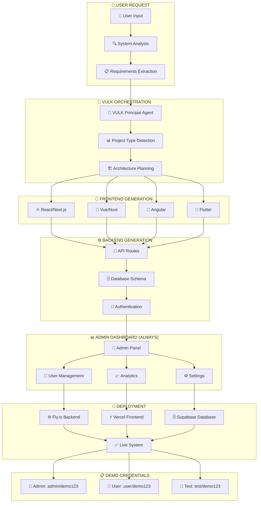

# 🚀 VULK - Sistema de Geração de Projetos Completos

## 📋 **Visão Geral**

O VULK deve gerar **SISTEMAS COMPLETOS E ROBUSTOS**, não apenas componentes isolados. Cada projeto gerado deve incluir:

- ✅ **Frontend** (React/Next.js, Vue, Angular, Flutter)
- ✅ **Backend** (API Routes, Node.js, Python, etc.)
- ✅ **Database** (PostgreSQL, MongoDB, SQLite)
- ✅ **Dashboard Admin** (sempre incluído)
- ✅ **Credenciais Demo** (automáticas)
- ✅ **Deploy** (Fly.io, Vercel, Supabase)

## 🎯 **Regras Fundamentais do Sistema**

### **1. REGRA DO DASHBOARD ADMIN (Obrigatória)**
```typescript
// Sempre incluir dashboard admin
const ADMIN_DASHBOARD_RULE = {
  required: true,
  path: "/admin",
  credentials: {
    username: "admin",
    password: "demo123",
    email: "admin@demo.com"
  },
  features: [
    "User Management",
    "Content Management", 
    "Analytics Dashboard",
    "System Settings"
  ]
};
```

### **2. REGRA DAS CREDENCIAIS DEMO (Obrigatória)**
```typescript
// Sempre fornecer credenciais demo
const DEMO_CREDENTIALS_RULE = {
  admin: { username: "admin", password: "demo123" },
  user: { username: "user", password: "demo123" },
  test: { username: "test", password: "demo123" }
};
```

### **3. REGRA DO SISTEMA COMPLETO (Obrigatória)**
```typescript
// Todo projeto deve ser full-stack
const COMPLETE_SYSTEM_RULE = {
  frontend: "required",
  backend: "required", 
  database: "required",
  authentication: "required",
  admin_panel: "required",
  deployment: "required"
};
```

## 🏗️ **Arquitetura de Sistema Completo**

### **📊 Diagrama de Sistema Completo VULK**



## 🎯 **Tipos de Projetos Suportados**

### **1. E-commerce Completo**
```typescript
const ECOMMERCE_SYSTEM = {
  frontend: {
    framework: "Next.js 14",
    features: ["Product Catalog", "Shopping Cart", "Checkout", "User Dashboard"]
  },
  backend: {
    api: "Next.js API Routes",
    features: ["Product Management", "Order Processing", "Payment Integration"]
  },
  database: {
    type: "PostgreSQL + Prisma",
    models: ["User", "Product", "Order", "Category", "Payment"]
  },
  admin: {
    dashboard: "/admin",
    features: ["Product Management", "Order Management", "User Management", "Analytics"]
  }
};
```

### **2. Dashboard Analytics**
```typescript
const DASHBOARD_SYSTEM = {
  frontend: {
    framework: "React + D3.js",
    features: ["Charts", "Tables", "Filters", "Export"]
  },
  backend: {
    api: "Node.js + Express",
    features: ["Data Processing", "Real-time Updates", "File Upload"]
  },
  database: {
    type: "MongoDB",
    collections: ["Metrics", "Users", "Reports", "Settings"]
  },
  admin: {
    dashboard: "/admin",
    features: ["Data Management", "User Permissions", "Report Generation"]
  }
};
```

### **3. SaaS Application**
```typescript
const SAAS_SYSTEM = {
  frontend: {
    framework: "Next.js + Tailwind",
    features: ["Multi-tenant", "Subscription", "Billing", "Settings"]
  },
  backend: {
    api: "Next.js API + Stripe",
    features: ["Subscription Management", "Payment Processing", "Tenant Isolation"]
  },
  database: {
    type: "PostgreSQL + Row Level Security",
    models: ["Tenant", "User", "Subscription", "Billing"]
  },
  admin: {
    dashboard: "/admin",
    features: ["Tenant Management", "Billing Overview", "User Analytics"]
  }
};
```

### **4. Mobile App (Flutter)**
```typescript
const FLUTTER_APP = {
  frontend: {
    framework: "Flutter",
    features: ["Cross-platform", "Native Performance", "Offline Support"]
  },
  backend: {
    api: "Node.js + Express",
    features: ["REST API", "Real-time", "Push Notifications"]
  },
  database: {
    type: "PostgreSQL + Redis",
    models: ["User", "Content", "Notifications", "Settings"]
  },
  admin: {
    dashboard: "/admin",
    features: ["App Management", "User Analytics", "Content Management"]
  }
};
```

## 🔧 **Implementação Técnica**

### **1. Sistema de Templates Flexíveis**

```typescript
// src/lib/templates/flexible-templates.ts
export interface FlexibleTemplate {
  id: string;
  name: string;
  type: 'ecommerce' | 'dashboard' | 'saas' | 'blog' | 'mobile' | 'custom';
  frameworks: {
    frontend: ('react' | 'vue' | 'angular' | 'flutter')[];
    backend: ('nextjs' | 'nodejs' | 'python' | 'go')[];
    database: ('postgresql' | 'mongodb' | 'mysql' | 'sqlite')[];
  };
  features: {
    required: string[];
    optional: string[];
  };
  admin: {
    always: true;
    features: string[];
    credentials: {
      username: string;
      password: string;
    };
  };
}

export const FLEXIBLE_TEMPLATES: FlexibleTemplate[] = [
  {
    id: 'ecommerce-complete',
    name: 'E-commerce Completo',
    type: 'ecommerce',
    frameworks: {
      frontend: ['react', 'vue', 'angular'],
      backend: ['nextjs', 'nodejs'],
      database: ['postgresql', 'mongodb']
    },
    features: {
      required: ['products', 'cart', 'checkout', 'payments', 'users'],
      optional: ['reviews', 'wishlist', 'recommendations']
    },
    admin: {
      always: true,
      features: ['product-management', 'order-management', 'user-management'],
      credentials: { username: 'admin', password: 'demo123' }
    }
  },
  {
    id: 'flutter-mobile',
    name: 'App Mobile Flutter',
    type: 'mobile',
    frameworks: {
      frontend: ['flutter'],
      backend: ['nodejs', 'python'],
      database: ['postgresql', 'mongodb']
    },
    features: {
      required: ['authentication', 'offline-support', 'push-notifications'],
      optional: ['camera', 'location', 'payments']
    },
    admin: {
      always: true,
      features: ['app-management', 'user-analytics', 'content-management'],
      credentials: { username: 'admin', password: 'demo123' }
    }
  }
];
```

### **2. Sistema de Regras Automáticas**

```typescript
// src/lib/rules/automatic-rules.ts
export class AutomaticRulesEngine {
  private static readonly RULES = {
    // REGRA 1: Sempre incluir dashboard admin
    adminDashboard: {
      enabled: true,
      path: '/admin',
      template: 'admin-dashboard',
      features: [
        'user-management',
        'content-management', 
        'analytics',
        'settings'
      ]
    },
    
    // REGRA 2: Sempre fornecer credenciais demo
    demoCredentials: {
      enabled: true,
      credentials: {
        admin: { username: 'admin', password: 'demo123' },
        user: { username: 'user', password: 'demo123' },
        test: { username: 'test', password: 'demo123' }
      }
    },
    
    // REGRA 3: Sistema sempre completo
    completeSystem: {
      enabled: true,
      components: ['frontend', 'backend', 'database', 'admin', 'deployment']
    }
  };
  
  static applyRules(projectConfig: ProjectConfig): ProjectConfig {
    const enhancedConfig = { ...projectConfig };
    
    // Aplicar regra do dashboard admin
    if (this.RULES.adminDashboard.enabled) {
      enhancedConfig.admin = {
        ...this.RULES.adminDashboard,
        ...enhancedConfig.admin
      };
    }
    
    // Aplicar regra das credenciais demo
    if (this.RULES.demoCredentials.enabled) {
      enhancedConfig.credentials = {
        ...this.RULES.demoCredentials.credentials,
        ...enhancedConfig.credentials
      };
    }
    
    return enhancedConfig;
  }
}
```

### **3. Gerador de Sistema Completo**

```typescript
// src/lib/generators/complete-system-generator.ts
export class CompleteSystemGenerator {
  async generateCompleteSystem(requirements: UserRequirements): Promise<CompleteSystem> {
    // 1. Análise de requisitos
    const analysis = await this.analyzeRequirements(requirements);
    
    // 2. Seleção de template flexível
    const template = this.selectFlexibleTemplate(analysis);
    
    // 3. Aplicação de regras automáticas
    const enhancedConfig = AutomaticRulesEngine.applyRules(template);
    
    // 4. Geração de frontend
    const frontend = await this.generateFrontend(enhancedConfig);
    
    // 5. Geração de backend
    const backend = await this.generateBackend(enhancedConfig);
    
    // 6. Geração de database
    const database = await this.generateDatabase(enhancedConfig);
    
    // 7. Geração de dashboard admin (sempre)
    const admin = await this.generateAdminDashboard(enhancedConfig);
    
    // 8. Configuração de credenciais demo
    const credentials = this.generateDemoCredentials();
    
    // 9. Deploy completo
    const deployment = await this.deployCompleteSystem({
      frontend,
      backend,
      database,
      admin,
      credentials
    });
    
    return {
      system: { frontend, backend, database, admin },
      credentials,
      deployment,
      urls: {
        frontend: deployment.frontendUrl,
        admin: `${deployment.frontendUrl}/admin`,
        api: deployment.backendUrl
      }
    };
  }
  
  private async generateAdminDashboard(config: ProjectConfig): Promise<AdminDashboard> {
    // Dashboard admin sempre incluído
    return {
      path: '/admin',
      features: [
        'User Management',
        'Content Management',
        'Analytics Dashboard',
        'System Settings'
      ],
      credentials: {
        username: 'admin',
        password: 'demo123'
      },
      components: [
        'AdminLayout',
        'UserTable',
        'AnalyticsChart',
        'SettingsPanel'
      ]
    };
  }
}
```

## 📱 **Suporte Flutter**

### **1. Configuração Flutter**

```typescript
// src/lib/frameworks/flutter-generator.ts
export class FlutterGenerator {
  async generateFlutterApp(config: FlutterConfig): Promise<FlutterApp> {
    return {
      framework: 'flutter',
      version: '3.16.0',
      features: [
        'Cross-platform (iOS/Android)',
        'Native Performance',
        'Offline Support',
        'Push Notifications'
      ],
      structure: {
        'lib/': [
          'main.dart',
          'screens/',
          'widgets/',
          'services/',
          'models/'
        ],
        'android/': ['Android configuration'],
        'ios/': ['iOS configuration']
      },
      dependencies: [
        'http: ^1.1.0',
        'provider: ^6.0.0',
        'shared_preferences: ^2.2.0',
        'firebase_core: ^2.24.0'
      ]
    };
  }
}
```

### **2. Templates Flutter**

```dart
// Template base para apps Flutter
class FlutterAppTemplate {
  static String generateMainApp() {
    return '''
import 'package:flutter/material.dart';
import 'package:provider/provider.dart';
import 'screens/home_screen.dart';
import 'screens/admin_screen.dart';
import 'services/auth_service.dart';

void main() {
  runApp(MyApp());
}

class MyApp extends StatelessWidget {
  @override
  Widget build(BuildContext context) {
    return MultiProvider(
      providers: [
        ChangeNotifierProvider(create: (_) => AuthService()),
      ],
      child: MaterialApp(
        title: 'VULK Generated App',
        theme: ThemeData(
          primarySwatch: Colors.blue,
          visualDensity: VisualDensity.adaptivePlatformDensity,
        ),
        home: HomeScreen(),
        routes: {
          '/admin': (context) => AdminScreen(),
        },
      ),
    );
  }
}
''';
  }
}
```

## 🚀 **Plano de Implementação**

### **Fase 1: Sistema de Regras (1-2 semanas)**
1. ✅ Implementar `AutomaticRulesEngine`
2. ✅ Criar sistema de templates flexíveis
3. ✅ Adicionar regra do dashboard admin
4. ✅ Adicionar regra das credenciais demo

### **Fase 2: Gerador Completo (2-3 semanas)**
1. ✅ Implementar `CompleteSystemGenerator`
2. ✅ Integrar com agentes existentes
3. ✅ Adicionar suporte Flutter
4. ✅ Testar geração de sistemas completos

### **Fase 3: Deploy Automático (1-2 semanas)**
1. ✅ Integrar com Fly.io, Vercel, Supabase
2. ✅ Automatizar deploy de sistemas completos
3. ✅ Configurar URLs e credenciais
4. ✅ Testar deploy end-to-end

### **Fase 4: Otimização (1 semana)**
1. ✅ Melhorar performance
2. ✅ Adicionar mais templates
3. ✅ Otimizar experiência do usuário
4. ✅ Documentação completa

## 🎯 **Resultado Final**

Cada projeto gerado pelo VULK será um **SISTEMA COMPLETO** com:

- ✅ **Frontend** funcional e responsivo
- ✅ **Backend** com APIs robustas
- ✅ **Database** configurada e populada
- ✅ **Dashboard Admin** em `/admin`
- ✅ **Credenciais Demo** fornecidas
- ✅ **Deploy** automático e funcional
- ✅ **URLs** de acesso direto

**Exemplo de saída:**
```
🚀 Sistema VULK Gerado com Sucesso!

📱 Frontend: https://meu-ecommerce.vercel.app
🔧 Backend: https://meu-ecommerce-api.fly.dev
🗄️ Database: https://meu-ecommerce.supabase.co
👑 Admin: https://meu-ecommerce.vercel.app/admin

🔑 Credenciais Demo:
   Admin: admin / demo123
   User: user / demo123
   Test: test / demo123
```

Este é o futuro do VULK: **SISTEMAS COMPLETOS, ROBUSTOS E FUNCIONAIS**! 🚀
